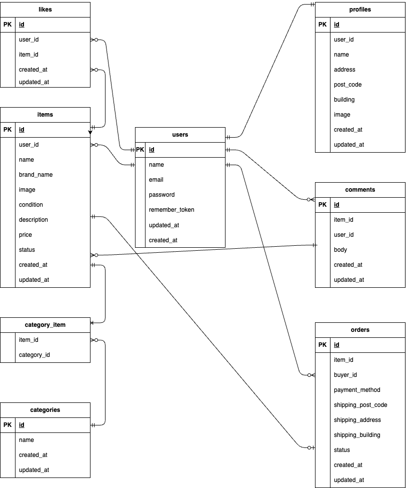

# 実践学習ターム 模擬案件初級_フリマアプリ

## 環境構築
**Dockerビルド**
1. `git clone https://github.com/Naoya-Tanioka/FreeMarket-app.git`
2. `cd FreeMarket-app`
3. DockerDesktopアプリを立ち上げる
4. `docker-compose up -d --build`

> *MacのM1・M2チップのPCの場合、`no matching manifest for linux/arm64/v8 in the manifest list entries`のメッセージが表示されビルドができないことがあります。
エラーが発生する場合は、docker-compose.ymlファイルの「mysql」内に「platform」の項目を追加で記載してください*
``` bash
mysql:
    platform: linux/x86_64(この文追加)
    image: mysql:8.0.26
    environment:
```

**Laravel環境構築**
1. `docker-compose exec php bash`
2. `composer install`
3. 「.env.example」ファイルを 「.env」ファイルに命名を変更。または、新しく.envファイルを作成
4. .envに以下の環境変数を追加
``` text
DB_CONNECTION=mysql
DB_HOST=mysql
DB_PORT=3306
DB_DATABASE=laravel_db
DB_USERNAME=laravel_user
DB_PASSWORD=laravel_pass
```
5. アプリケーションキーの作成
``` bash
php artisan key:generate
```
6. マイグレーションの実行
``` bash
php artisan migrate
```
7. シーディングの実行
``` bash
php artisan db:seed
```
8. シンボリックリンク作成
``` bash
php artisan storage:link
```

## メール認証機能について

今回のアプリでは、会員登録後にメール認証を行う仕様になっています。

---

### ■ メール認証の手順

1. 会員登録を行う
2. メール認証誘導画面へ遷移する
3. 「認証はこちらから」ボタンを押下する
4. MailHog画面が開く
5. 届いた認証メールを開き、本文内のVerify Email Addressボタンをクリックする
6. メール認証完了後、プロフィール設定画面へ遷移する

---

### ■ メール確認方法（開発環境）

本アプリでは、開発環境においてメール送信の確認に **MailHog** を使用しています。

以下のURLにアクセスすることで、送信されたメールを確認できます。
http://localhost:8025

### ■ メール設定（.env）

開発環境では以下の設定を使用してください。


MAIL_MAILER=smtp
MAIL_HOST=mailhog
MAIL_PORT=1025
MAIL_USERNAME=null
MAIL_PASSWORD=null
MAIL_ENCRYPTION=null
MAIL_FROM_ADDRESS=test@example.com
MAIL_FROM_NAME="${APP_NAME}"


## Stripe決済のテスト方法

今回のアプリではStripeのWebhookを使用しています。

ローカル環境で決済テストを行う場合、以下の手順を実行してください。

1. Stripe CLIをインストール
https://stripe.com/docs/stripe-cli
2. ログイン
3. Webhook転送を開始

表示された `whsec_...` を `.env` に設定してください。

4. 決済テスト
通常通り購入操作を行ってください。

## 使用技術（実行環境）
php:8.1-fpm
Latavel:8.83.29
MySQL8.0.26

##　テーブル設計


## ER図



## URL
・開発環境：http://localhost
・phpMyAdmin:http://localhost:8080